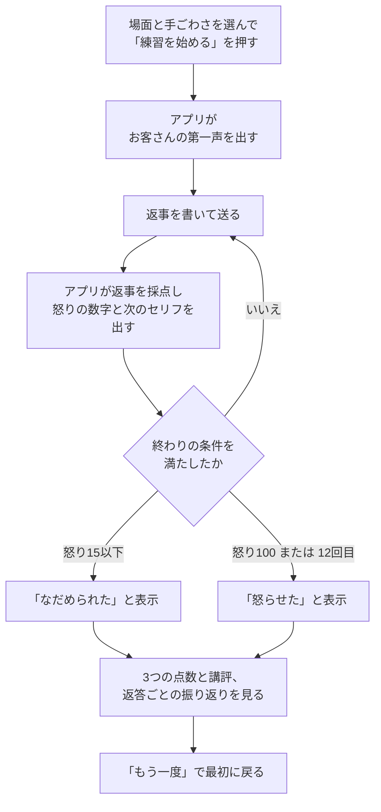
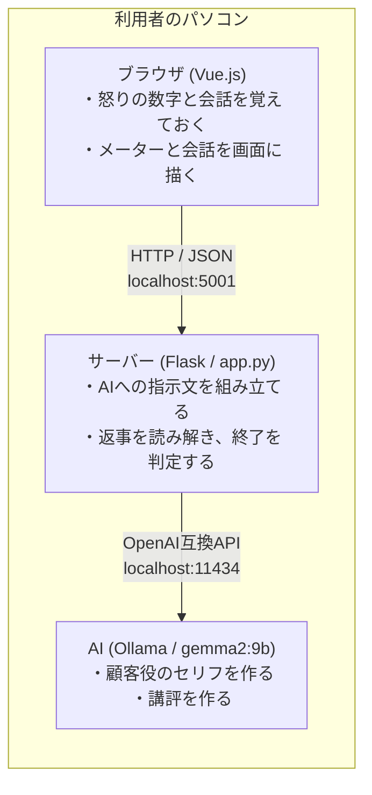
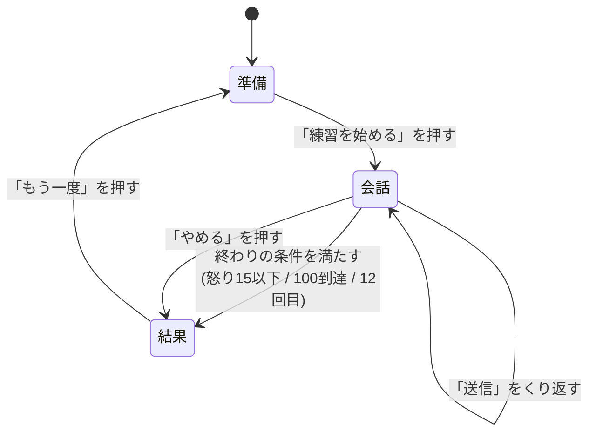
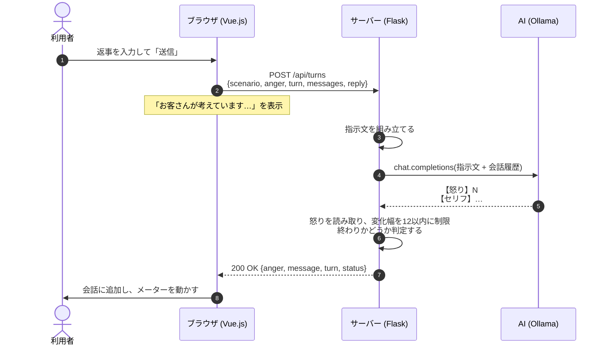

# 要件定義書・基本設計書: クレトレ

作成日: 2026年9月1日(最終更新 9月4日)/ 作成者: 中川 颯都(チーム15)

## この資料の読み方

全部で3万字あります。最後まで読まなくても分かるように、次の形にしています。

- **各章のはじめに「ひとことで言うと」を置いています**。そこだけ拾えば、全体の流れは10分でつかめます。
- **「なぜそうしたか」の経緯や比較は、折りたたみに入れています**。三角形の見出しをクリックすると開きます。結論は折りたたみの外に書いてあるので、開かなくても困りません。
- **専門の言葉には、その場で日本語の説明を添えています**。正式名称も残してあるので、あとから調べられます。

## 3分でわかる全体像

| 問い | 答え |
|---|---|
| 何を作ったか | クレーム対応の練習アプリ「クレトレ」。AIが怒ったお客さんを演じ、利用者は店員として応対します |
| なぜ作ったか | 新人がクレーム対応を覚える機会が、実質**本番しかない**ためです。失敗しても誰にも迷惑がかからない練習の場を作りました |
| どうやって測るか | 応対の良し悪しを**怒りの数字**(0〜100)で表します。終わると3つの観点で講評が出ます |
| 何でできているか | ブラウザ(Vue.js)・サーバー(Flask)・AI(Ollama)の3つ。**すべて同じパソコンの中**で動き、インターネットは要りません |
| どこで終わるか | 怒りが**15以下**なら成功、**100に達する**か**12回**やり取りしたら失敗です |

---

# 第1部 要件定義

## 1. システム名とキャッチコピー

**ひとことで言うと**: 怒ったお客さん役のAIを相手に、クレーム対応を何度でも練習できるアプリです。

| 項目 | 内容 |
|------|------|
| システム名 | **クレトレ**(クレーム対応トレーニング) |
| キャッチコピー | **怒らせても大丈夫。何度でも失敗できる、クレーム対応の練習場。** |

### どんなアプリか

AIがお客さん役になって怒ります。あなたは店員として、それをなだめます。

うまく対応すると**怒りメーター**が下がります。まずい対応をすると上がります。最後にAIが「ここが良かった、ここを直そう」と教えてくれます。

## 2. 使う人(ペルソナ)

**ひとことで言うと**: 想定する利用者は、サポート業務1年目の新人です。上司に気をつかわず練習したいと思っています。

**ペルソナ**とは「こういう人に使ってほしい」という架空の人物のことです。作るときの目印になります。

| 項目 | 内容 |
|------|------|
| 名前 | 佐藤 美咲(さとう みさき) |
| 年齢 | 23歳 |
| 仕事 | 家電量販店のお客様相談窓口。入社1年目 |
| パソコンの得意さ | スマホは普通に使える。パソコンは仕事で使うが、設定は苦手 |
| 困っていること | お客さんに強く怒られると頭が真っ白になり、謝ることしかできなくなる |

### ユーザーストーリー

「誰が」「何のために」「何がほしい」を1文で書いたものです。

> **お客様相談窓口の新人として**、クレーム対応の練習を安全にするために、**AIがお客さん役をしてくれる練習アプリがほしい**。

### なぜ作るのか

いまは**本物のお客さん相手でしか練習できません**。つまり、新人はお客さんに迷惑をかけながら覚えるしかない状態です。練習の場を別に作れば、この問題がなくなります。

## 3. 今と、これから(As-Is / To-Be)

**ひとことで言うと**: 今は本番でしか練習できません。これを、何度でも失敗できる練習の場に変えます。

**As-Is** は「今こうなっている」、**To-Be** は「こうなってほしい」という意味です。この2つを並べると、何が足りないかがはっきりします。

### As-Is(今の状態)

- 練習できるのは月に1回の研修だけ。回数が少なすぎる
- 練習相手が上司や先輩なので、気をつかって思いきり失敗できない
- 自分の対応が良かったのか悪かったのか、判断する目安がない
- 結局、本物のお客さん相手で初めて失敗することになる

### Gap(足りないもの)

**練習の回数**と**良し悪しを教えてくれるもの**。この2つが両方ありません。だから新人は上達のしかたが分からないまま、現場に出ることになります。

### To-Be(こうなってほしい)

- いつでも、何回でも、一人で練習できる
- 相手はAIなので、どんなに失敗しても誰にも迷惑がかからない
- 怒りメーターの数字で、自分の一言が良かったか悪かったかがすぐ分かる
- 終わったあとに「ここを直そう」と具体的に教えてもらえる

## 4. 使うときの流れ(業務フロー図)

**ひとことで言うと**: 場面を選ぶ → 返事を送る → 怒りが動く → 講評を見る、の4段階です。

利用者とアプリが、どういう順番でやり取りするかを表した図です。



### うまくいかないときのために決めたこと

図を書くと、失敗したときの動きを決め忘れていないかが分かります。

- 返事が空っぽのまま送られたら、送らずに「入力してください」と出す
- AIとの通信に失敗したら、その場でエラーを出す。会話は消さず、もう一度送れる
- 返事の回数が上限に達したら、怒りの数字に関係なく終わって講評へ進む

## 5. 機能要件

**ひとことで言うと**: 作る機能は7つです。必ず作る5つが先で、残り2つは余裕があれば作ります(結果として全部作れました)。

**機能要件**とは「アプリができること」の一覧です。「〜できること」の形で書くと、できたかどうかを後で確かめやすくなります。

| ID | できること | 優先度 |
|----|-----------|--------|
| FR1 | 利用者が、場面(商品の不具合 / 納期の遅れ / 店員の態度)を選んで練習を始められること | Must |
| FR2 | 利用者が、お客さん役のAIと文字で会話し、自分の返事に対する反応をもらえること | Must |
| FR3 | 利用者が、自分の返事で上下する怒りの数字を、数字とバーでいつでも見られること | Must |
| FR4 | 利用者が、怒りが十分下がるか、逆に最大になった時点で、成功か失敗かの結果を見られること | Must |
| FR5 | 利用者が、会話の後に「話を聞けたか」「謝り方」「解決策を出せたか」の3つの点数とアドバイスを見られること | Must |
| FR6 | 利用者が、始めるときにお客さんの手ごわさを選べること | あとで |
| FR7 | 利用者が、終わった後に会話全体と怒りの数字の変化を振り返れること | **完了** |

**Must** は「絶対に作るもの」、**あとで**(Nice to Have)は「余裕があれば作るもの」です。Mustの5つが完成してテストに通るまで、あとでの2つには手をつけません。

Mustの5つとテストが完了し予定より前倒しできたため、FR6(手ごわさの選択)とFR7(振り返り)も実装しました。

## 6. 非機能要件

**ひとことで言うと**: 主な約束は3つ。**5秒以内**に返事が出ること、**ネットなしで動く**こと、**入力を保存しない**ことです。

**非機能要件**とは「できること」ではなく「**どれくらいちゃんと動くか**」の約束です。速さ、安全さ、壊れにくさなどが入ります。

| 種類 | 約束すること |
|------|-------------|
| 可用性(いつでも使えるか) | インターネットがつながっていなくても動くこと |
| 性能(速さ) | 返事を送ってからお客さんのセリフが出るまで5秒以内(実測は2〜3秒) |
| 拡張性(あとで増やせるか) | 新しい場面を足すとき、AIへの指示文を書き足すだけで済むこと |
| セキュリティ(安全さ) | 入力した文章を保存せず、外部にも送らないこと |
| 運用・保守性(壊れにくさ) | AIの返事の形がくずれても、アプリが止まらず会話を続けられること |
| 移行性・環境(動く場所) | Chrome と Safari の最新版で動くこと。Python 3.13 と Ollama が入っていることが前提 |

## 7. どこまで作るかの方針(QCDS)

**ひとことで言うと**: 品質と締め切りは守ります。遅れたときは、作る量のほうを削ります。

**QCDS** は、開発でぶつかる4つの都合の頭文字です。全部を同時に良くすることはできないので、何を優先するか先に決めておきます。

| 記号 | 意味 | 今回の方針 |
|------|------|-----------|
| Q | 品質 | Mustの5機能がテストに通ることを最優先にする |
| C | お金と人 | 一人で作る。外部の有料AIを使わず、お金をかけない |
| D | 締め切り | 最終日の発表は動かせない |
| S | 作る量 | 遅れたら「あとで」の機能を削る。品質と締め切りは守る |

途中で新しいアイデアが浮かんでも、メモに書くだけにします。Mustが終わるまでは作りません。

---

# 第2部 基本設計

要件定義で決めた「何を作るか」を、「どう作るか」に翻訳します。

## A. システム構成

**ひとことで言うと**: ブラウザ・サーバー・AIの3つが、すべて同じパソコンの中で動きます。覚えておく役はブラウザが持ちます。



3つの部品はすべて利用者のパソコンの中で動きます。外のネットワークには出ません。

### A-1. どこで・誰が・いつ・どうやって動くか(5W1H)

設計書に抜けやすい実行環境と技術仕様を、まとめて書いておきます。

設計書は、実装のことを知らない人が読んでも動かせるように書きます。専門の言葉が出てくるときは、その場で日本語の言いかえを添えます。

| 観点 | 内容 |
|---|---|
| **Where**(どこで動くか) | ブラウザ、サーバー、AI の3つとも、**同じパソコンの中**で動きます。ブラウザは Chrome か Safari の最新版。サーバーは Python 3.11〜3.13 と Flask で、**ポート**(パソコンの中の受付番号)は **5001** を使います。5000 を使わないのは、macOS の AirPlay がその番号を先に使っているためです。AI(Ollama)は 11434 番です |
| **Where**(ネット接続) | **つながっていなくても動きます**。AIも画面の部品(Vue)も手元に置いてあります。データベースも、外部のサービスも使いません |
| **Who**(誰が使うか) | 店員役として練習する人が1人だけです。ログインも、管理者と一般利用者の区別もありません。何人かが同時に使うことは考えていません |
| **When**(いつ動くか) | 利用者が「練習を始める」「送信」「やめる」「もう一度」を押したときだけ動きます。決まった時刻に自動で動く処理はありません。ただしサーバーを起動したときに1回だけ、AIをメモリに読み込む準備をします |
| **How**(やり取りの決まり) | 画面とサーバーは **HTTP** という約束ごとで話し、**JSON** という書き方でデータを渡します。文字は **UTF-8**(日本語が文字化けしない文字の並べ方)で送ります。窓口の名前の付け方は **REST** の考え方(第C章)にそろえます |
| **How**(エラーの形) | エラーは **Problem Details** という決まった形にそろえます。世界共通の取り決め(**RFC 7807**)として文書になっているもので、「どこで・何が・なぜ」を同じ並びで返します。形が1つなら、画面側の受け取り方も1つで済みます |
| **How**(使っている道具) | Flask 3.1(サーバー)、openai 2.46(AIを呼ぶための道具)、pydantic 2.13、Vue.js 3(画面。手元に置いてある)、pytest 9.1(自動テスト)。正確な版は `requirements.txt` に書いてあります |
| **How**(安全のための決まり) | ログインの仕組みはありません。AIを呼ぶときの**合いことば**(APIキー)は、手元のOllama向けの形だけのもので、秘密の情報ではありません。**CORS**(別のサーバーからの呼び出しを許すかどうかの設定)は要りません。画面もAPIも同じサーバーが配っているためです |

### 層の分け方

役割ごとに3つの層に分け、上から下へ一方向にだけ頼る形にします。下の層が上の層を知らない作りにすると、片方を直しても、もう片方が壊れません。

| 層 | 置き場所 | 役割 |
|---|---|---|
| 画面の層 | `static/index.html` | 画面を描く。入力を受け取る |
| 処理の層 | `app.py` | AIへの指示を組み立てる。返事を読み解く |
| AIの層 | Ollama | 文章を作る |

### 覚えておく役をどちらにするか

怒りの数字と会話の履歴は、**ブラウザ側が覚えます**。サーバーには毎回まとめて送ります。

サーバーは何も覚えません(**ステートレス**といいます)。データベースもログイン管理も作らずに済みます。作るものが減るぶん、大事な機能に時間を使えます。

かわりに会話が長くなるほど送るデータが増えますが、上限は12往復(`app.py` の `MAX_TURNS`)なので問題になりません。

## B. 画面設計

**ひとことで言うと**: 画面は1つだけです。その中で「準備」「会話」「結果」の3つの場面が切り替わります。

### B-1. 画面一覧

画面は1つだけです。中身が3つの場面に切り替わります。

| 場面 | 見えるもの |
|---|---|
| 準備 | 場面の選択、難易度の選択、「練習を始める」ボタン |
| 会話 | 怒りメーター、会話のログ、入力欄、「送信」ボタン |
| 結果 | 成功か失敗かの判定、講評カード、「もう一度」ボタン |

### B-2. 画面の考え方

チャットアプリではなく、**訓練コンソール**として設計します。相手の状態を計器で読みながら操作する、シミュレーターの形にします。

| 決めたこと | 理由 |
|---|---|
| ほぼ白の地に、怒りの熱が上から差し込む | 練習の場は明るく開いた場所にする。熱は相手のものだけにする |
| 怒りの強さを3色で表す(緑・黄・朱) | 数字を読まなくても、色だけで状態が分かる |
| 見出しは明朝、本文はゴシック、数値は等幅 | 日本語らしい対比をつける。書体はネット不要のものだけ使う |
| お客さんの表情を絵で見せる(SVG。B-2-2で説明) | 数字より表情のほうが状態が直感的に伝わる |
| 怒りが下がると画面全体が冷める | うまくいっている感覚を体で感じられるようにする |

#### 地の色を濃紺から白へ変えた理由

地の色は、当初の**濃紺から、ほぼ白へ変えました**。練習を何度もくり返す道具なので、見た目の緊張感より、長く使える読みやすさを優先したためです。

<details>
<summary>4つの観点で比べた表を見る</summary>

当初は**濃紺の地**に熱が差し込む配色にしていた。計器らしさは出たが、実際に使うと問題があった。

| | 濃紺の地(当初) | ほぼ白の地(現在) |
|---|---|---|
| 画面の印象 | 緊張感が強く、長い練習だと疲れる | 落ち着いて続けられる |
| 文字の読みやすさ | 白文字が細く見え、長い講評が読みにくい | 標準的な黒文字で読みやすい |
| 怒りの色の見え方 | 地が暗いぶん朱色が沈む | 白地なので朱色がはっきり立つ |
| 発表・印刷 | スクリーンや紙で潰れる | そのまま使える |

**練習を何度もくり返す道具**なので、見た目の緊張感よりも、長く使える読みやすさを優先しました。熱の演出はそのまま残し、地の色だけを反転させています。

</details>

### B-2-1. ワイヤーフレーム

**準備の画面**

```
┌────────────────────────────────────────┐
│  クレトレ                                        │
│  怒らせても、誰にも迷惑がかからない練習場。          │
│  ──────────────────────────────  │
│  対応する事例                                     │
│  ┌──────────────────────────────┐│
│  │ 商品の不具合「買ったばかりなのに、もう壊れてる！」  ││
│  └──────────────────────────────┘│
│  ┌──────────────────────────────┐│
│  │ 納期の遅れ「今日届くはずでしょ？」               ││
│  └──────────────────────────────┘│
│                                                 │
│  相手の手ごわさ                                   │
│  [やさしめ 60] [ ふつう 80 ] [きびしめ 95]          │
│                                                 │
│                            [ 対応を始める ]        │
└────────────────────────────────────────┘
```

事例カードには、そのお客さんの第一声を添える。選ぶ前にどんな相手か分かるようにするため。

**会話の画面**

```
┌────────────────────────────────────────┐
│  クレトレ      商品の不具合 / ふつう      [中断する]  │
│  ┌──────────────────────────────┐│
│  │  ( 表情 )   怒りの強さ                 80     ││
│  │            ████████████████░░░░       ││
│  │            目標 15 以下 ／ やり取り 3 / 12 回  ││
│  └──────────────────────────────┘│
│  ──────────────────────────────  │
│  お客さん                                        │
│  ┃ 買ったばかりなのに、もう壊れてるんだけど！        │
│                                       あなた     │
│              ┌────────────────────┐  │
│              │ 誠に申し訳ございません。        │┃ │
│              └────────────────────┘  │
│  ┌───────────────────┐  [ 返答する ]     │
│  │ お客さんへの返答を入力    │                   │
│  └───────────────────┘                  │
└────────────────────────────────────────┘
```

**結果の画面**

```
┌────────────────────────────────────────┐
│  対応の結果                                       │
│  落ち着いてもらえました                             │
│  最終の怒り 12 ／ やり取り 6 回 ／ 商品の不具合        │
│  ──────────────────────────────  │
│  ┌── 講評(白い評価票)─────────────────┐│
│  │  話を聞けたか     ████░  4/5                ││
│  │  謝り方          ███░░  3/5                ││
│  │  解決策を出せたか  █████  5/5                ││
│  │  ──────────────────────────  ││
│  │  相手の話をさえぎらずに聞けていました。…        ││
│  └──────────────────────────────┘│
│                       [ 別の事例で練習する ]        │
└────────────────────────────────────────┘
```

星ではなく5段の帯で点数を示す。怒りメーターと同じ「帯で量を表す」言い方に揃えるため。

### B-2-2. お客さんの表情

怒りの値に応じて、顔の各部が変わります。顔は画像ファイルではなく、**SVG**(線や円の位置を数字で書いて絵にする形式)で描きます。数字で描くので、拡大しても輪郭がぼやけず、色も画面の中から変えられます。

| 部位 | 怒りが低いとき | 怒りが高いとき |
|------|--------------|--------------|
| 眉 | 水平 | 内側が下がって吊り上がる |
| 目 | 丸い | 細くなる |
| 口 | ゆるやかな上向き | への字 |
| 輪郭の色 | 緑 | 赤 |
| 外側の輪 | 見えない | 赤くにじむ |

### B-3. 画面の4大状態(State)

見た目だけでなく、**動いている最中の状態**も決めます。

| 状態 | いつ | 画面の見え方 |
|---|---|---|
| **通常 (Idle)** | 入力を待っているとき | 入力欄が使える。送信ボタンが青く光る |
| **処理中 (Loading)** | AIの返事を待っているとき | 送信ボタンを押せなくする。ボタンの中にぐるぐるを出す。会話ログの下に「お客さんが考えています...」と薄く出す |
| **成功 (Success)** | 返事が返ってきたとき | 新しいセリフを会話ログに足す。怒りメーターを新しい数字までなめらかに動かす |
| **異常 (Error)** | 通信に失敗したとき | 会話ログの下に赤い枠でエラー理由を出す。「もう一度送る」ボタンを出す。**入力した文章は消さない** |

異常のときに入力を消さないのは大事です。せっかく書いた返事が消えると、やり直す気力がなくなります。

### B-4. 画面の移り変わり(画面遷移図)



会話の途中で「やめる」を押した場合も、結果の場面へ進みます。そこまでの会話で講評を出します。

### B-5. 怒りメーターの見せ方

| 怒りレベル | 色 | 様子 |
|---|---|---|
| 0〜30 | 緑 | 落ち着いている |
| 31〜70 | 黄 | 不満をもっている |
| 71〜100 | 赤 | 強く怒っている |

数字が変わるとき、パッと切り替えずに0.5秒かけて動かします。変化に気づきやすくなります。

## C. API設計

**ひとことで言うと**: サーバーの窓口は3つです。会話を始める、返事を送る、講評をもらう、の3つだけです。

### C-1. 名前の付け方の方針

窓口の名前は、**動詞ではなく名詞**にしました(`/api/start` ではなく `/api/conversations`)。授業で習った REST の考え方にそろえています。

<details>
<summary>変更前と変更後の対応、そう決めた理由を見る</summary>

授業の資料に「**URLに動詞を入れない。名詞にする**」という決まりがありました。

最初は `/api/start` `/api/reply` `/api/review` という名前を考えていましたが、これは動詞です。次のように名詞へ変えました。

| 変更前 | 変更後 | 意味 |
|---|---|---|
| `/api/start` | `POST /api/conversations` | 会話を1つ作る |
| `/api/reply` | `POST /api/turns` | やり取りを1回分作る |
| `/api/review` | `POST /api/reviews` | 講評を1つ作る |

すべて「POST(作る)」と「名詞(作るもの)」の組み合わせになりました。

</details>

### C-2. 共通の決まり

- やり取りはすべて JSON 形式
- キー名は英小文字とアンダースコアでつなぐ
- 成功したときは `200 OK` を返す

作ったものを返すときは `201 Created` を使うのが本来ですが、**サーバーは何も保存しない**ため `200 OK` を使います。保存していないのに「作りました」と答えるのは正確ではないためです。

### C-3. POST /api/conversations(会話を始める)

お客さん役の第一声をもらいます。

**送るもの**

```json
{
  "scenario": "product_defect",
  "difficulty": "normal"
}
```

| キー | 型 | 必須 | 中身 |
|---|---|---|---|
| `scenario` | 文字列 | 必須 | `product_defect`(商品の不具合)/ `delivery_delay`(納期の遅れ)/ `staff_attitude`(店員の態度) |
| `difficulty` | 文字列 | 任意 | `easy` / `normal` / `hard`。省略すると `normal` |

**返ってくるもの (200 OK)**

```json
{
  "anger": 80,
  "message": "買ったばかりなのに、もう壊れてるんだけど！どうしてくれるの？",
  "turn": 0,
  "status": "continue"
}
```

| キー | 型 | 中身 |
|---|---|---|
| `anger` | 数値 | 今の怒りレベル(0〜100) |
| `message` | 文字列 | お客さんのセリフ |
| `turn` | 数値 | 何回目のやり取りか |
| `status` | 文字列 | `continue` / `resolved` / `escalated` |

難易度ごとの最初の怒りレベルは、`easy` が 60、`normal` が 80、`hard` が 95 です。

### C-4. POST /api/turns(返事を送る)

自分の返事を送り、新しい怒りレベルとお客さんのセリフをもらいます。

**送るもの**

```json
{
  "scenario": "product_defect",
  "difficulty": "normal",
  "anger": 80,
  "turn": 0,
  "messages": [
    { "role": "customer", "text": "買ったばかりなのに、もう壊れてるんだけど！" }
  ],
  "reply": "このたびはご不便をおかけし、誠に申し訳ございません。"
}
```

| キー | 型 | 必須 | 中身 |
|---|---|---|---|
| `scenario` | 文字列 | 必須 | 場面 |
| `difficulty` | 文字列 | 任意 | 手ごわさ |
| `anger` | 数値 | 必須 | 今の怒りレベル |
| `turn` | 数値 | 必須 | 今が何回目か |
| `messages` | 配列 | 必須 | ここまでの会話。`role` は `customer` か `staff` |
| `reply` | 文字列 | 必須 | 自分の返事。空文字は不可 |

**返ってくるもの (200 OK)**

```json
{
  "anger": 60,
  "message": "謝るのは当然でしょ。それで、どうしてくれるの？",
  "turn": 1,
  "status": "continue"
}
```

### C-5. POST /api/reviews(講評をもらう)

会話が終わったあと、全体の評価をもらいます。

**送るもの**

```json
{
  "scenario": "product_defect",
  "messages": [ "…会話の全部…" ],
  "result": "resolved"
}
```

**返ってくるもの (200 OK)**

```json
{
  "scores": {
    "listening": 4,
    "apology": 3,
    "solution": 5
  },
  "comment": "相手の話をさえぎらずに聞けていました。一方で謝り方が決まり文句になっていました。"
}
```

| キー | 型 | 中身 |
|---|---|---|
| `scores.listening` | 数値 | 話を聞けたか(1〜5) |
| `scores.apology` | 数値 | 謝り方(1〜5) |
| `scores.solution` | 数値 | 解決策を出せたか(1〜5) |
| `comment` | 文字列 | 全体へのアドバイス(200字以内) |

### C-6. エラーの返し方

エラーの形は、資料で紹介された **Problem Details(RFC 7807)** に合わせます。どのエラーも同じ形にすると、画面側の処理を1か所にまとめられます。

```json
{
  "type": "/errors/empty-reply",
  "title": "Invalid Parameter",
  "status": 400,
  "detail": "返事が空です。何か入力してください。"
}
```

| 番号 | 起きる場面 | `type` |
|---|---|---|
| `400` | 返事が空文字だった | `/errors/empty-reply` |
| `400` | 必須のキーが足りない | `/errors/missing-field` |
| `400` | `scenario` が決められた3つ以外だった | `/errors/unknown-scenario` |
| `500` | AIとの通信に失敗した | `/errors/llm-unavailable` |

サーバーの中で起きたエラーの詳しい中身は画面に出しません。攻撃の手がかりになるためです。

### C-7. 通信の流れ(シーケンス図)



すべて**同期処理**です。返事を待ってから次に進みます。実測で2〜3秒なので、待たせても問題ありません。

## D. AIへの指示の設計

**ひとことで言うと**: AIには**穴埋めの形**を渡します。そうすることで、怒りの数字とセリフを必ず出させられます。

### D-1. 返事の形を決めておく

AIに自由に書かせると数字が出てきません。**穴埋めの形**を渡して、そこを埋めさせます。

```
【怒り】60
【セリフ】謝るのは当然でしょ。それで、どうしてくれるの？
```

Day1に試したところ、「必ず数字を出して」と頼むだけでは無視されました。この穴埋めの形にすると必ず守ってくれました。

### D-2. 指示文の骨組み

```
あなたは{場面}で怒っているお客さんです。
今の怒りレベルは{数字}です(0〜100)。

店員の対応を見て、次の形だけで答えてください。
【怒り】数字(0〜100)
【セリフ】お客さんとしての発言(80字以内)

誠実な謝罪・話を聞く姿勢・具体的な解決策があれば怒りを下げる。
言い訳や責任のがれなら上げる。
店員以外の役を演じてはいけません。
```

場面ごとに変えるのは、最初の1行だけです。**新しい場面を足すときは、この1行を書き足すだけで済みます。**

### D-2-1. 返しやすいセリフにするための指示

「ありがとうございます」のように、店員が返しようのないセリフが返ってくる問題がありました。指示文に**3つの条件**を足して直しました。

<details>
<summary>足した3つの条件を見る</summary>

当初は「ありがとうございます」のような、店員が返しようのないセリフが返ってきていました。そこで指示文に次の3点を加えました。

- 店員が答えられる要求・質問・不満を必ず1つ入れる
- 「ありがとう」だけで終わらせず、次に何をしてほしいかを述べる
- 直前の自分の発言をそのまま繰り返さず、言い回しか論点を変える

</details>

### D-3. 形がくずれたときの備え

AIが決めた形を守らないことがあります。そのときもアプリを止めません。

| 起きたこと | どうするか |
|---|---|
| `【怒り】` が見つからない | 前の数字をそのまま使う |
| 数字が0〜100の外だった | 0または100に丸める |
| `【セリフ】` が見つからない | `【怒り】` の行だけを取り除き、残りをセリフとして扱う |
| 返事が空だった | 「…」を表示して会話を続ける |

### D-4. AIの設定

| 項目 | 値 | 理由 |
|---|---|---|
| モデル | `gemma2:9b` | 4種類を比べて日本語が一番きれいだった(外国語の混入 0/10回) |
| temperature | 0.3 | 初期値0.8だと英語やスペイン語が混ざった |

## E. 終わりの条件

**ひとことで言うと**: 怒りが15以下なら成功。100に達するか、12回やり取りしたら失敗です。

| 判定 | 条件 |
|---|---|
| 落ち着かせた (`resolved`) | 怒りレベルが **15以下** になった |
| 怒らせた (`escalated`) | 怒りレベルが **100に達した** |
| 打ち切り | 返事の回数が **12回** に達した |

### 会話が短すぎた問題への対応

終わりの条件は、当初の「20以下で成功・上限10回」から「**15以下で成功・上限12回**」に変えました。あわせて、1回で動く怒りの幅を12までに制限しました。会話が3往復で終わってしまい、練習にならなかったためです。

<details>
<summary>実際に何が起きたか、3つの変更の内容を見る</summary>

当初は「20以下で成功・上限10回」としていましたが、実際に使うと**3往復で終わってしまいました**。良い返事1回で怒りが20下がるため、80から始めると3回で届いてしまいます。これでは練習になりません。

そこで次の3点を変えました。

| 変えたこと | 前 | 後 |
|---|---|---|
| 1回で動く怒りの幅 | 制限なし | **最大12まで** |
| 成功とみなす値 | 20以下 | 15以下 |
| やり取りの上限 | 10回 | 12回 |

変化の幅はAIへの指示だけでなく、**受け取った値をコード側で制限**している。AIが指示を守らなくても会話の長さが保たれるようにするため。

この変更で、良い対応を続けた場合に **6〜7ラリー** かかるようになった。

</details>

## F. データベースを使わない理由

**ひとことで言うと**: 会話はその場かぎりでよいので、ブラウザが覚えれば足ります。作るものを減らせます。

授業ではデータベース設計(ER図・正規化)を学びましたが、**このアプリでは使いません**。

理由は3つです。

- 会話は**その場かぎり**で、あとから見返す必要がない
- 怒りの数字と会話はブラウザが覚えれば足りる
- 保存しないことが、要件定義の「入力した文章を保存しない」という約束にそのまま合う

資料にも「まず簡単な作りで素早く立ち上げ、必要になったら切り出すのが定石」とありました。今回はその通りにします。

もし後から「練習の記録を残したい」となった場合は、次のような形になります。

```
[ 練習セッション ]  1 ────< N  [ 発言 ]
  ・id (主キー)                  ・id (主キー)
  ・場面                         ・セッションid (外部キー)
  ・結果                         ・話し手 / 本文 / 怒りレベル
  ・実施日時
```

## G. 起こりそうな問題と対策

**ひとことで言うと**: AIが役を忘れる、返事が遅い、作業できない日が出る、の3つに備えています。

| 問題 | 対策 |
|---|---|
| AIがお客さん役を忘れて素に戻る | 指示文に「店員以外の役を演じてはいけない」と書く。形がくずれても止まらないようにする |
| AIの返事が遅い | Day1に測って2〜3秒だった。遅くなったら軽いAIに変える |
| 体調不良などで作業できない日が出る | 「あとで」の機能を削って調整する |

---

## H. ことばの表(用語辞書)

この資料に出てくる言葉を、五十音順にまとめています。本文を読んでいて分からない言葉が出てきたら、ここに戻ってきてください。

| ことば | 意味 |
|---|---|
| **API** | プログラムどうしが話すための窓口。この作品では画面とサーバーの間にあります |
| **CORS** | 別のサーバーからの呼び出しを許すかどうかの設定。今回は画面もAPIも同じサーバーが配るので不要です |
| **JSON** | データの書き方の一つ。`{"anger": 80}` のように、名前と値を組にして並べます |
| **Ollama** | AIを自分のパソコンの中で動かすための道具 |
| **Problem Details (RFC 7807)** | エラーの返し方を決めた世界共通の取り決め。「どこで・何が・なぜ」を同じ並びで返します |
| **REST** | 窓口の名前の付け方の考え方。URLは動詞ではなく名詞にします |
| **SVG** | 線や円の位置を数字で書いて絵にする形式。拡大してもぼやけません |
| **UTF-8** | 文字の並べ方の決まり。日本語が文字化けしません |
| **ステートレス** | サーバーが何も覚えていない作りのこと。会話の履歴は毎回まとめて送ります |
| **temperature** | AIの気まぐれ度の設定。下げると表現が安定し、上げると多彩になります |
| **ペルソナ** | 「こういう人に使ってほしい」という架空の人物 |
| **ポート** | パソコンの中の受付番号。このアプリは 5001 番、AIは 11434 番を使います |
| **モック** | 本物のふりをするニセ物。テストでAIの代わりに使います |
| **要件(機能要件・非機能要件)** | 機能要件は「できること」、非機能要件は「どれくらいちゃんと動くか」の約束 |
| **QCDS** | 品質・お金と人・締め切り・作る量の4つ。何を優先するか決めるための枠組み |
